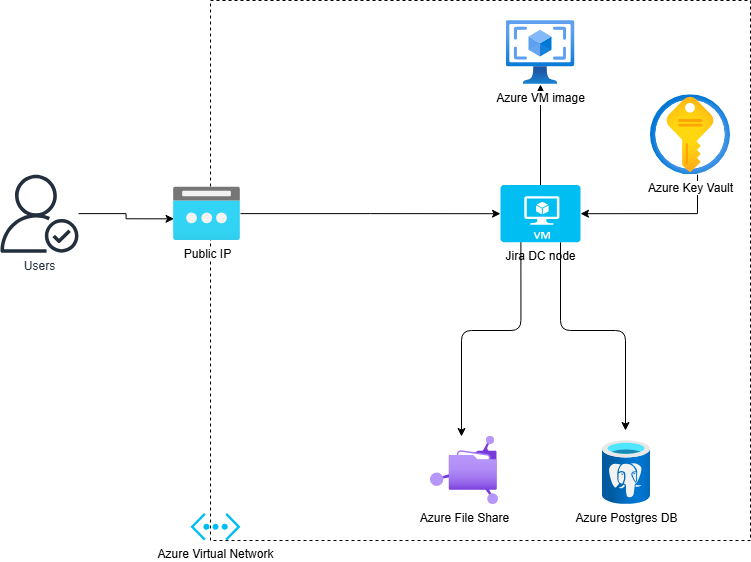
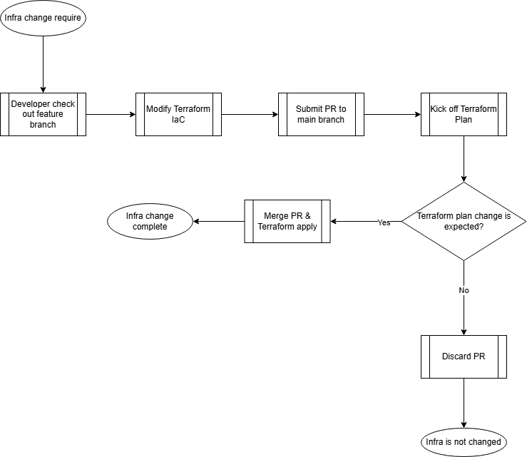

# azure-jira-deployment
JIRA data centre deployment  
## Description
This repository demonstrates the deployment of a JIRA Data Center on Azure. The process leverages Terraform on HashiCorp Cloud and Ansible to automate the deployment of JIRA on the Azure Cloud.
### Phase One Deployment
The MVP goal for this phase is to automatically up the JIRA instance on a single node.
## Hosting Solution Design Diagram

- Azure Virtual Network
    - The virtual network to host the Jira instance that enable the communication within the internet.
- Public IP
    - Enable the inbound communication from the internet to the Jira instance. 
    - Use a preditable IP address to enable the outbound connectivity to the internet.
- Azure VM Image
    - Create a customised Linux golden image for Jira DC host.
    - It contains the configuration settings that apply to the deployment.
- Jira DC node 
    - Deploy a Standard_DS2_V2 virtual machine (VM) to run the Jira instance.
- Azure File Share 
    - Create a SMB file share to be mounted by virtual machine to store the configuration files for Jira application.
- Azure Postgres DB
    - Deploy PostgreSQL flexible server to store and manage the issues, project, user information and configuration data for Jira.
- Azure Key Vault
    - Deploy Standard key vault to store the credentials that enables the access from VM to the storage account and PostgreSQL database. 
## Auto Deployment Process 
The section describe the auto deployment process of the Jira data centre.
### Process Diagram

### Deployment Process
The deployment process is driven by GitOps and Terraform.
- Build Jira golden image in Azure Resource Group
- Provision resources on Azure Cloud by using Terraform Cloud
- Cloud-init of the VM calls [Jira Ansible playbook](https://github.com/angelqyguo/ansible-jiranode-playbook) to finish the configuration 

## TODO
- Replace VM with VMSS
- Enhance keyvault and storage security
